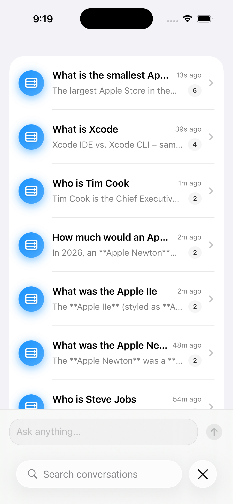
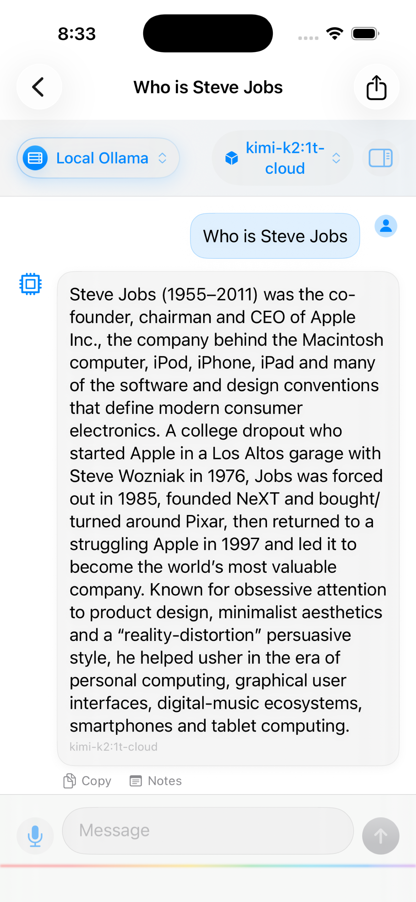
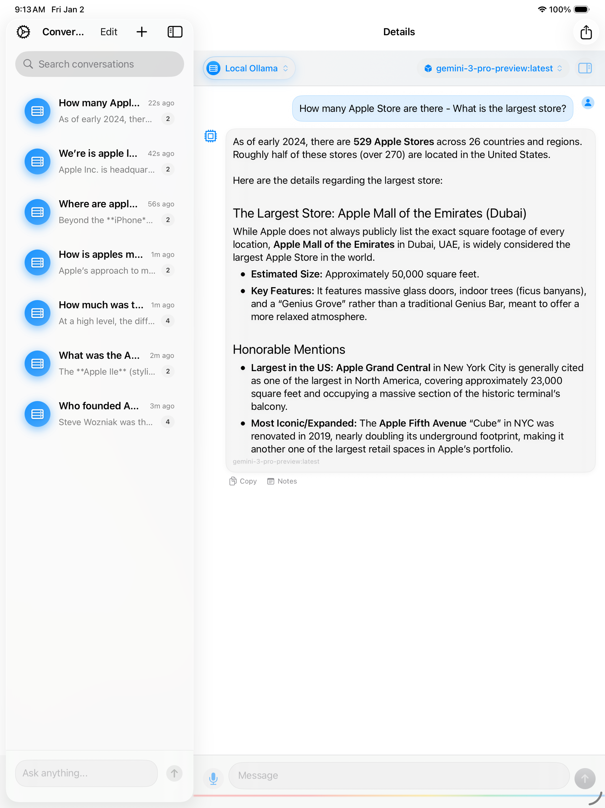

# OllamaRemote

A modern iOS/iPadOS client for interacting with Large Language Models (LLMs) across multiple providers.

**Version:** 1.4.0
**Platform:** iOS 18+ / iPadOS 18+
**License:** GPL-3.0
**Developer:** [Richard Young](https://deepknow.ai/richard)

## Features

### Multi-Provider Support
- **Local Ollama** - Connect to Ollama running on your local network (IP:port)
- **Ollama Cloud** - Connect to Ollama's cloud service with API key
- **OpenRouter** - Access 200+ models including free tiers from OpenAI, Anthropic, Google, Meta, and more
- **On-Device** *(Coming Soon)* - Run Core ML models locally using Apple's Neural Engine

### Chat Experience
- **Streaming Responses** - Real-time token streaming for responsive conversations
- **Markdown Rendering** - Beautiful formatting of code blocks, lists, headers, and more
- **Conversation History** - Persistent chat history with SwiftData
- **Auto-Generated Titles** - Conversations automatically named from first message
- **Search** - Find past conversations by title or content
- **Rename Conversations** - Long-press to rename any conversation
- **Share/Export** - Export conversations as markdown

### User Experience
- **Adaptive Layout** - Optimized for both iPhone and iPad
- **Dark/Light Mode** - Follows system appearance
- **Font Size Control** - Adjustable text size (-2 to +2)
- **Haptic Feedback** - Tactile feedback for actions (toggleable)
- **Copy Messages** - One-tap copy for AI responses
- **Quick Start** - Start new conversations directly from the main screen

### iPad Keyboard Shortcuts
- `⌘ + Return` - Send message
- `⌘ + N` - New conversation
- `⌘ + ,` - Open settings

### Security
- **Keychain Storage** - API keys stored securely in iOS Keychain
- **No Telemetry** - Your conversations stay on your device

## On-Device Models (Coming Soon)

> **Note:** On-device inference with Core ML and Neural Engine is coming in a future update. The models listed below will be available for download once this feature is released.

### Planned Core ML Models (Neural Engine)
| Model | Size | Parameters |
|-------|------|------------|
| Apple OpenELM 270M | 270 MB | 270M |
| Apple OpenELM 450M | 450 MB | 450M |
| Apple OpenELM 1.1B | 1.1 GB | 1.1B |
| SmolLM 135M (Fastest) | 135 MB | 135M |

## Screenshots

### iPhone
<p align="center">
  
  
</p>

### iPad
<p align="center">
  
</p>

## Installation

### Requirements
- iOS 18.0+ / iPadOS 18.0+
- Xcode 16.0+
- Swift 6.0+

### Build from Source

1. Clone the repository:
```bash
git clone https://github.com/ricyoung/OllamaRemote.git
cd OllamaRemote
```

2. Open the workspace in Xcode:
```bash
open OllamaRemote.xcworkspace
```

3. Select your target device and build (⌘+R)

## Configuration

### Local Ollama Setup
1. Install [Ollama](https://ollama.ai) on your Mac/PC
2. Start Ollama: `ollama serve`
3. In OllamaRemote, go to Settings > Local Ollama
4. Enter your computer's IP address and port (default: 11434)
5. Test Connection to verify

### OpenRouter Setup
1. Sign up at [OpenRouter](https://openrouter.ai)
2. Get your API key from [openrouter.ai/keys](https://openrouter.ai/keys)
3. In OllamaRemote, go to Settings > OpenRouter
4. Enter your API key
5. Enable "Prefer Free Models" for cost-free usage

## Project Architecture

```
OllamaRemote/
├── OllamaRemote.xcworkspace/     # Open this in Xcode
├── OllamaRemotePackage/          # Main development area
│   └── Sources/OllamaRemoteFeature/
│       ├── Models/
│       │   ├── Provider/         # Provider configurations
│       │   ├── Chat/             # Conversation & Message models
│       │   └── LLM/              # LLM request/response types
│       ├── Services/
│       │   ├── Providers/        # LLM provider implementations
│       │   ├── Network/          # HTTP client & streaming
│       │   └── Storage/          # Keychain & settings
│       └── Views/
│           ├── Chat/             # Chat UI components
│           ├── Conversations/    # Conversation list
│           ├── Settings/         # Settings screens
│           └── Components/       # Reusable components
└── Config/                       # Build configuration
```

## Technology Stack

- **SwiftUI** - Modern declarative UI
- **SwiftData** - Persistent conversation storage
- **@Observable** - State management (not ObservableObject)
- **async/await** - Swift concurrency
- **Keychain** - Secure credential storage

## Contributing

Contributions are welcome! Please feel free to submit a Pull Request.

## License

This project is licensed under the GPL-3.0 License - see the [LICENSE](LICENSE) file for details.

## Acknowledgments

- [Ollama](https://ollama.ai) for local LLM inference
- [OpenRouter](https://openrouter.ai) for unified LLM API access
- [Apple](https://developer.apple.com/machine-learning/core-ml/) for Core ML and Neural Engine
- Built with [XcodeBuildMCP](https://github.com/cameroncooke/XcodeBuildMCP)

---

**Developed by [Richard Young](https://deepknow.ai/richard)**
